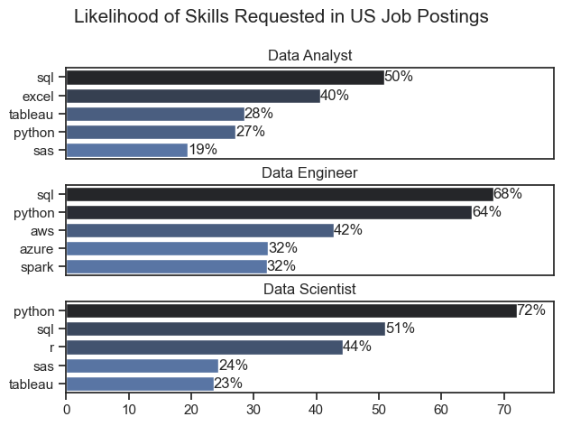
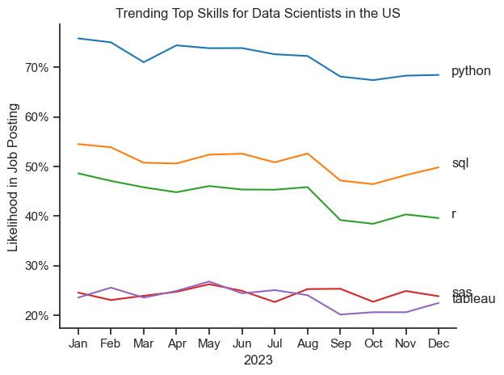
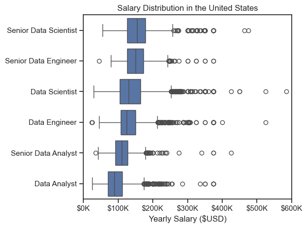
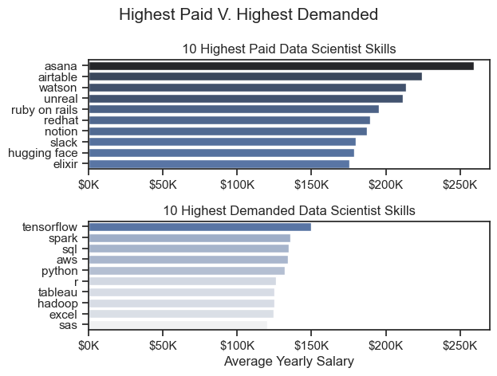
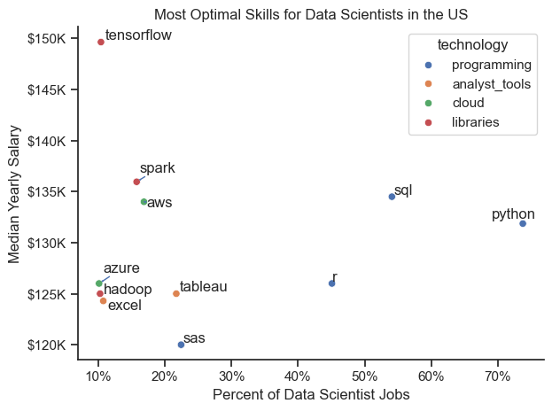

# Introduction

Welcome to my in depth analysis into the data job market, focusing on Data Scientist roles within the US. This project was built to explore the workings of the US job market more effectively. It looks into the top-paying and in-demand skills which could drive the decision making of future Data Scientist choosing to enter the field. 

The data used in this analysis is from [Luke Barousse's Python Course](https://huggingface.co/datasets/lukebarousse/data_jobs) which has set the foundations and provided a framework for my analysis. Through the use of Python, I have sought to answer questions around the most demanded skills, salary trends, and the intersection of demand and salary in data analytics.

# Questions Posed

Below are the questions I want to answer within the project:

1. What are the most in-demand skills for the top three most popular data roles?
2. What are the trends for in-demand skills for Data Scientists?
3. How well do jobs and skills pay for Data Scientists?
4. What are the best skills for Data Scientists to learn? (considering both high demand and high paying skills).

# Tools Used

- **Python**: Used throughout the entirety of my project, allowing me to break down and analyze the data for critical insights. To help in this process the following libraries were used:
    - **Pandas Library**: This helped in analyzing the data.
    - **Matplotlib Library**: Used to visualize the data.
    - **Seaborn Library**: Added to the visuals from matplotlib to improve style and structure.
- **Jupyter Notebooks**: A tool I used to run all my Python scripts allowing me to easily place notes and run my analysis. 
- **Visual Studio Code**: Used to execute my Python scripts.
- **Git & GitHub**: Essential for version control and sharing both my Python code and analysis.

# Data Preparation and Cleanup

### **Measures Taken**:
- I first import the necessary libraries and load in the dataset for which I will be analyzing. 
- I then make sure to check that all data is formatted correctly
- df["job_posted_date"] was converted to datetime format before analysis.
- df["job_skills"] was converted into an object format prior to analysis.

# The Analysis

## 1. What are the most demanded skills for the 3 most popular data roles?

In order to discover the in demand skills for the top 3 most popular data roles, I filtered out the three most popular data roles and then found the top 5 in demand skills that correspond to each given role. This means the query effectively highlights the most popular job titles and their respective most popular skills, showing the skills I should pay attention to depending on the the role I'm focussing on.

 View the notebook with the steps included here: [2_Skills_Demand](3_Project/2_Skills_Demand.ipynb)

 ### Labelling the Visualisation

 ```Python
 for i, job_title in enumerate(job_titles):
    df_plot = df_skills_perc[df_skills_perc["job_title_short"] == job_title].head(5)
    
    sns.set_theme(style="ticks")
    sns.barplot(data=df_plot, x="skill_percent", y="job_skills", ax=ax[i], hue="skill_count", palette="dark:b_r")
    
    ax[i].set_xlim(0, 78)
    ax[i].set_title(job_title)
    ax[i].set_ylabel("")
    ax[i].set_xlabel("")
    ax[i].get_legend().remove()
    for j in range(len(df_plot)):
        ax[i].text(df_plot["skill_percent"].iloc[j],
                   df_plot["job_skills"].iloc[j],
                   f'{int(df_plot["skill_percent"].iloc[j]):.0f}%',
                   va="center")
```

### Results 



### Insights

- Python and SQL are skills that are highly valued within all three job roles.

- Python is found in required skills nearly three quarters of the time, making it an essential skill within this job role.

- Data Analyst Roles posses a more even proportioned spread of skills within their job postings while both Data Engineers and Data Scientists have very strongly weighted skills comparative to much lower requested skills. 

## 2. How are in-demand skills trending for Data Scientists?

### Visualize Data

```python

df_plot = df_DS_US_percent.iloc[:, :5]

sns.lineplot(data=df_plot, dashes=False, palette="tab10")
sns.set_theme(style="ticks")
sns.despine()

for i in range(5):
    plt.text(11.4, df_plot.iloc[-1, i], df_plot.columns[i], ha="left")

ax=plt.gca()
ax.yaxis.set_major_formatter(mtick.PercentFormatter())

plt.tight_layout()
plt.show()
```
### Results



*Line plot visualizing the trending top skills for data scientists in the US in 2023.*

### Insights

- For Data Scientists, Python remains the highest posted skill throughout the year relative to the other highest four. 

- When comparing from the start to the end of the year, both Python and R and have experienced a small and steady decrease in job posting likelihood. 

- With the data on only one year, it is likely that the popularity of each skill could fluctuate. For example, despite SQL having a relative decline, the uptick in job postings felt in October could persist into the new year.

- Given there are no severe declines in job posting likelihood for each of the five skills, it is safe to invest time into learning them for the forseeable future.

## 3. How well do jobs and skills pay for Data Scientists?

### Salary Analysis for Job Roles

#### Visualise Data 

```python
sns.set_theme(style="ticks")
sns.boxplot(data=df_US_top6, x="salary_year_avg", y="job_title_short", order=job_order)
plt.xlim(0,600_000)
ax = plt.gca()
ax.xaxis.set_major_formatter(plt.FuncFormatter(lambda x, pos: f"${int(x/1000)}K" ))
plt.tight_layout()
plt.show()
```

#### Results

*Box plot visualising the salary distribution for the top 6 data job titles.*

#### Insights

- Despite Data Scientists being below the median salary of the respective Senior Data Engineer and Senior Data Scientists, both the junior Data Scientist and Data Engineer roles sit above the Senior Data Analyst role. 

- Data Scientists are offered the highest median salary of all three junior data roles within the US and the Senior Data Scientist leads with the highest overall median salary when compared to all senior roles present in the results. 

- Data Scientists have the widest variety of salaries present within the data, ranging from a low of around $30K/year to a high of almost $600K/year.

### Highest Paid & Most Demanded Skills for Data Scientists

#### Visualise Data

```python
fig, ax = plt.subplots(2, 1)

sns.set_theme(style="ticks")

sns.barplot(data=df_DS_top_pay, x="median", y=df_DS_top_pay.index, ax=ax[0], hue="median", palette="dark:b_r" )

sns.barplot(data=df_DS_skills, x="median", y=df_DS_skills.index, ax=ax[1], hue="median", palette = "light:b")

plt.tight_layout()

plt.show()
```



*Two separate bar graphs visualizing the highest paid skills and most in-demand skills for data scientists in the US.*

#### Insights

- All of the skills which pay the highest for Data Scientists aren't present on the 10 highest demanded skills for Data Scientists, meaning they appear very few times in job postings. This means although the pay the most, it is also worthwhile learning skills which are highly demanded given the likelihood of postings. 

- There is a sharp relative increase in the pay of the top 10 highest paid compared with that of the top 10 demanded, making it worthwhile to learn a mix of skills from both areas to maximize chances of attaining a job while being able to apply for higher paying positions. 

## 4. What is the most optimal skill to learn for Data Scientists?

#### Visualise Data

```python
from adjustText import adjust_text


sns.scatterplot(
    data=df_plot,
    x = "skill_percent",
    y = "median_salary",
    hue = "technology"
)

texts=[]
for i, txt in enumerate(df_DS_skills_high_demand.index):
    texts.append(plt.text(df_DS_skills_high_demand["skill_percent"].iloc[i], df_DS_skills_high_demand["median_salary"].iloc[i], txt))
```

#### Results



*A scatter plot visualising the most optimal skills (high paying & high demand) for data scientists in the US.*

#### Insights

- Of the 10 percent or higher Data Scientist job postings, tensorflow is the highest paying skill, followed by spark, both of which happen to be libraries. Therefore, learning a library based technology is necessary to qualify for the higher paying Data Scientist roles.

- Of the 10 percent or higher Data Scientist job postings, Python is the most popular skill, followed by SQL , R, ans SAS, all of which are technologies based in programming. Thus programming based skills are essential for meeting the requirements of most Data Scientist job postings. 

- Skills which are most popular sit within the middle of the Median Yearly Salary whilst less popular skills in job postings have much more variance covering both the lowest and highest paying skills for Data Scientists. One might be able to note that skills posted less are either done so given low popularity (lower salaries) or for higher specialized jobs (higher salaries).

# What I Learned

Throughout the project, I was presented with new ways of using python to fully understand the workings of the US job market for Data Scientists.

- **Advanced Python Skill Set**: Throughout my analysis, I was utilizing libraries such as Pandas for data manipulation, while using Matplotlib and Seaborn for my data visualization, using other libraries to assist in my analysis throughout. 
- **Data Cleaning Usage**: I was reminded of how important clean data is before conducting any form of analysis, thus ensuring results at the end of my analysis were unbiased and accurate.
- **Strategic Skill Analysis**: Throughout the analysis, I found the importance of striking a balance between learning in demand skills and high paying skills alongside each other, allowing me to improve upon my career planning within the tech industry. 

# Insights

The project provided me detailed insights into the US data job market for Data Scientists:
- **Skill Demand and Salary Correlation**: Within the analysis, I found that the most in demand skills commanded fairly large salaries while those demanded less had a greater range, from the bottom bracket of Data Scientists salary to the upper bracket. 
- **Market Trends**: Trends in skill demand are constant, meaning one must stay up to date to see whether there skills are valued equally over time. 
- **Economic Value of Skills**: Striking a balance between high -demand and high-paying skills is key to maximizing economic returns as a data-scientist. 

# Challenges I've Faced

Throughout this project, I faced some challenges. 

- **Labelling Plot Points Within Subplots**: The complexity of labelling scatterplot points within subplots leads for a lot of nested coding, making it easy to accidentally reference the wrong code within a for loop. 
- **Date Index Alignment**: The process of setting up indexes to manipulate the order of dates within grouped data added many steps in the organization process.
- **Deciding Scope of Analysis**: It's easy to include too many variables to explain your analysis, which would have overcomplicated the visualization. Thus, simplicity is essential but enough information is needed to convey a relationship.

# Conclusion

Throughout this project, I have made many discoveries which have informed me on the most desirable skills for Data Scientists within the US Job Market. Given the US is one of the largest employers of roles in data analytics, these insights provide valuable information for myself as I look into career paths around Data Science. The project itself has greatly improved my ability to clean, analyze and visualize data within Python. I hope to build upon these skills to help me in future projects.
